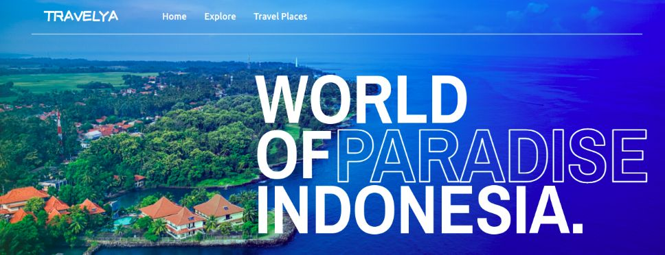

# Travelya 

### [Site link](https://peaceful-rosalind-8f71ec.netlify.app/)

<kbd>
  
</kbd>

 ### 🛠 The tech stack is:

- [React](https://reactjs.org/)
- [TypeScript](https://www.typescriptlang.org/)
- [Tailwindcss](https://tailwindcss.com/docs/guides/create-react-app)
- [Styled-components](https://styled-components.com/)
- [Twin.macro](https://github.com/ben-rogerson/twin.macro)
- [TypeScript](https://www.typescriptlang.org/)
- [HTML5](https://en.wikipedia.org/wiki/HTML5)
- [CSS3](https://en.wikipedia.org/wiki/Cascading_Style_Sheets)
- [Flexbox](https://en.wikipedia.org/wiki/CSS_Flexible_Box_Layout)
- [Create-react-app](https://create-react-app.dev/docs/getting-started/)
- [eslint](https://eslint.org/)

